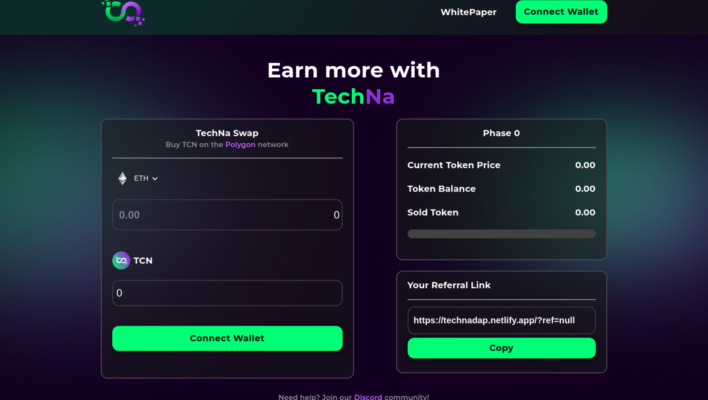
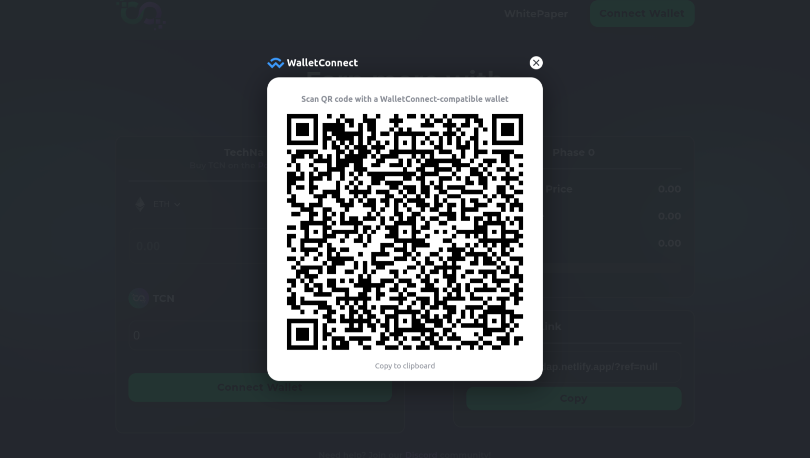

# Web3.O Presale React App

  

## Overview
This application is a Web3-powered presale platform where users can purchase tokens before they are available.
The application supports various cryptocurrencies such as BNB and ETH. Users can also share referral links to earn rewards.

## Technologies Used
##### Web3.js: JavaScript library for interacting with the Ethereum blockchain.
##### Blockchain: Ethereum or compatible blockchain where smart contracts are deployed.
##### React: Front-end library for building user interfaces.
##### Material-UI: Component library for Material Design styling.
##### Figma: A design tool for creating and translating designs into React components.

### `Features`
Support for multiple cryptocurrencies (e.g., BNB, ETH).
Referral system with coupon codes.
User-friendly interface built with Material-UI.
Integration with blockchain through Web3.js.
Responsive design based on Figma designs.

### Installation

 ## 1: Clone the repository:
 
 git clone https://github.com/yourusername/web3-presale-app.git
 cd web3-presale-app

## 2: install dependencies:

npm install

## 3: run application

npm start

## Usage
### Connecting Wallet:

  

Ensure MetaMask or another Ethereum wallet is installed and configured.
Click the "Connect Wallet" button on the application to connect your wallet.
### Buying Tokens:

Enter the amount of tokens you wish to purchase.
Select the cryptocurrency you want to use (e.g., ETH, BNB).
Click the "Purchase Tokens" button and confirm the transaction in your wallet.
### Using Referral Links:

Share your unique referral link with others.
Users who sign up using your link will be tracked for referral rewards.
Smart Contract Deployment.

### Deploying Contracts:

Ensure your smart contract is deployed on the blockchain. Update the REACT_APP_CONTRACT_ADDRESS environment variable with the deployed contract address.

### Smart Contract Code:

Located in the contracts directory.
Written in Solidity.
Includes functions for token purchases and referral tracking.

"Feel free to adjust the details according to your specific project setup and requirements. Let me know if there are any additional details you’d like to include!"

